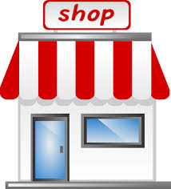

# small_shop
 
 ## Table of Contents

- [Introduction](#introduction)
- [Features](#features)
- [Requirements](#requirements)
- [Installation](#installation)
- [Configuration](#configuration)
- [Usage](#usage)
- [Testing](#testing)
- [Contributing](#contributing)
- [License](#license)
- [Contact](#contact)

# Introduction
Small_Shop is a web application built with the Laravel framework. It is designed to provide a streamlined and efficient platform for managing small-scale retail operations. The application includes features such as product management, inventory tracking, and sales reporting. This project demonstrates best practices in Laravel development, including clean API design, robust authentication, and a responsive user interface tailored for ease of use in a retail environment.

# Features
Product Management: Easily add, update, and manage products, including details such as pricing, descriptions, and categories. The system supports multiple product categories and subcategories for better organization.

Inventory Tracking: Monitor stock levels in real-time, receive alerts for low inventory, and automatically update stock quantities upon sales. This feature helps prevent stockouts and ensures that the shop operates efficiently.

Sales Reporting: Generate detailed reports on sales performance, including daily, weekly, and monthly sales summaries. These reports help shop owners track revenue and identify top-selling products.

Customer Management: Maintain a database of customers with their purchase histories and contact information, enabling personalized service and targeted marketing campaigns.

Order Management: Manage customer orders from initiation to fulfillment, including order status tracking, payment processing, and receipt generation.

Invoice Generation: Automatically generate and print invoices for customer orders, with options for customization to reflect the shop’s branding.

User Authentication and Roles: Implement secure authentication for shop staff with different access levels. Admins have full control, while sales staff can be restricted to certain operations.

Responsive Design: The application is fully responsive, ensuring that it functions seamlessly on both desktop and mobile devices, making it accessible for shop owners on the go.

Promotions and Discounts: Easily create and apply discounts or promotional offers on products, which can be time-limited or ongoing, to boost sales.

# Requirements
- PHP 8.1 or higher
- Composer
- MySQL or any other supported database
- Laravel CLI generate for readme 

# Installation
   # Step 1: Install XAMPP
 1.  Download & Install XAMPP:
   Get XAMPP from apachefriends.org and install it with Apache and MySQL modules.
Start XAMPP:

2. Open the XAMPP Control Panel and start Apache and MySQL.
   
 # Step 2: Install Composer
1. Download & Install Composer:
Download Composer from getcomposer.org and install it globally.
Verify Installation:

2. Run composer --version in your terminal to confirm Composer is installed.

# Step 3: Create a Laravel Project
 # # Navigate to XAMPP htdocs:
  
  Open terminal/command prompt and run:

  ```
  cd C:\xampp\htdocs
  ```
# # Create a Laravel Project:
Run the following command to create a new Laravel project:

```
composer create-project --prefer-dist laravel/laravel small_shop
```
# # Set Up the Project:
Navigate into the project directory:

```
cd small_shop
```

# # Set up the environment:
```
cp .env.example .env
php artisan key:generate
```
# # Run the Application:
Start the Laravel development server:

```
php artisan serve
```

# Step 4: Push to GitHub
1. Initialize Git:
Run:

```
git init
git add .
git commit -m "Initial commit"
```
2. Push to GitHub:
 Create a GitHub repository, then add and push
```
git remote add origin https://github.com/your-username/small_shop.git
git push -u origin main
```

# Configuration
Customize your environment settings by editing the .env file. Typical configuration settings include:

- Database: Configure your database connection in the DB_* variables.
- Mail: Set up your mailing system in the MAIL_* variables.
- Cache: Configure your caching mechanism in the CACHE_* variables.

# Usage
After installation, you can start using the application by visiting http://localhost:8000 in your browser.

# Image


#Url Image


 